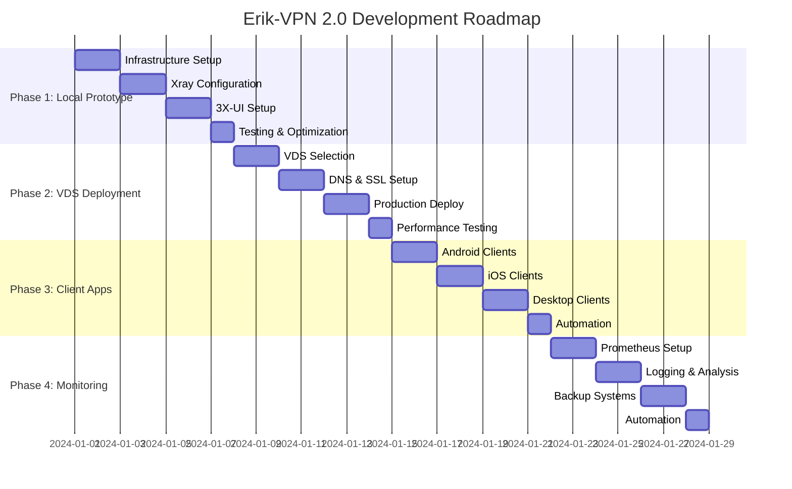

# 🛣️ Дорожная карта разработки Erik-VPN 2.0

**VLESS + Reality VPN с панелью управления 3X-UI**

## 📋 Обзор проекта

### Цель
Создание современного VPN-сервиса с максимальной стойкостью к блокировкам на базе протокола VLESS + Reality.

### Технологический стек
- **Протокол**: VLESS + Reality (Xray-core)
- **Панель управления**: 3X-UI
- **Контейнеризация**: Docker + Docker Compose
- **Мониторинг**: Prometheus + Grafana (опционально)
- **Безопасность**: Fail2Ban (опционально)

## 🎯 Фазы разработки

---

## 📅 Фаза 1: Локальный прототип (Неделя 1)

### 🎪 Цели
- [x] Базовая архитектура проекта
- [ ] Локальное развертывание и тестирование
- [ ] Настройка базовой конфигурации VLESS + Reality
- [ ] Тестирование подключений с разных устройств

### 📋 Задачи

#### День 1-2: Подготовка инфраструктуры
- [x] ✅ Обновление структуры проекта
- [x] ✅ Создание docker-compose.yml для Xray-core + 3X-UI
- [x] ✅ Настройка переменных окружения
- [x] ✅ Создание скрипта автоматической установки
- [ ] 🔄 Тестирование установки на локальной машине

#### День 3-4: Конфигурация Xray-core
- [ ] 📝 Настройка базовой конфигурации VLESS + Reality
- [ ] 📝 Выбор и настройка доменов для маскировки
- [ ] 📝 Генерация ключей и сертификатов
- [ ] 📝 Оптимизация параметров производительности

#### День 5-6: Настройка 3X-UI
- [ ] 📝 Первоначальная конфигурация панели
- [ ] 📝 Создание шаблонов пользователей
- [ ] 📝 Настройка базовых правил безопасности
- [ ] 📝 Тестирование веб-интерфейса

#### День 7: Тестирование и оптимизация
- [ ] 📝 Тестирование подключений с Android/iOS
- [ ] 📝 Тестирование подключений с Windows/macOS
- [ ] 📝 Проверка скорости и стабильности
- [ ] 📝 Документирование найденных проблем

### 📊 Критерии успеха
- ✅ Docker Compose запускается без ошибок
- ⏳ 3X-UI панель доступна по адресу localhost:2053
- ⏳ Успешное создание пользователя VLESS + Reality
- ⏳ Подключение минимум с 2 разных типов устройств
- ⏳ Скорость подключения > 10 Mbps

---

## 🌐 Фаза 2: VDS развертывание (Неделя 2)

### 🎪 Цели
- Выбор оптимального VDS провайдера
- Развертывание на производственном сервере
- Настройка DNS и SSL сертификатов
- Оптимизация производительности

### 📋 Задачи

#### День 1-2: Выбор и настройка VDS
- [ ] 📝 Анализ VDS провайдеров по критериям:
  - 💰 **Цена**: $3-8/месяц
  - 🌍 **Локация**: минимальный пинг до РФ
  - 🏃 **Производительность**: CPU, RAM, Network
  - 🛡️ **Репутация**: отзывы, надежность
- [ ] 📝 Регистрация и настройка VDS
- [ ] 📝 Первоначальная настройка сервера (SSH, пользователи, обновления)
- [ ] 📝 Установка базового ПО (Docker, утилиты)

#### День 3-4: DNS и SSL
- [ ] 📝 Регистрация домена (опционально)
- [ ] 📝 Настройка DNS записей
- [ ] 📝 Получение SSL сертификатов (Let's Encrypt)
- [ ] 📝 Настройка автоматического обновления сертификатов

#### День 5-6: Развертывание и оптимизация
- [ ] 📝 Развертывание Erik-VPN на VDS
- [ ] 📝 Настройка системных параметров (sysctl, limits)
- [ ] 📝 Оптимизация TCP/UDP параметров
- [ ] 📝 Настройка файрвола и безопасности

#### День 7: Тестирование производительности
- [ ] 📝 Нагрузочное тестирование
- [ ] 📝 Тестирование стабильности соединений
- [ ] 📝 Замеры скорости из разных локаций
- [ ] 📝 Оптимизация конфигурации

### 📊 Критерии успеха
- ⏳ Сервер доступен 24/7 с uptime > 99%
- ⏳ Скорость подключения > 50 Mbps
- ⏳ Пинг до Москвы < 50ms
- ⏳ SSL сертификаты обновляются автоматически
- ⏳ Все порты и сервисы защищены

### 💰 Рекомендуемые VDS провайдеры

| Провайдер | Локация | Цена/мес | RAM | CPU | Disk | Bandwidth |
|-----------|---------|----------|-----|-----|------|-----------|
| **Vultr** | Tokyo | $3.50 | 512MB | 1vCPU | 10GB | 0.5TB |
| **DigitalOcean** | Frankfurt | $4.00 | 512MB | 1vCPU | 10GB | 0.5TB |
| **Linode** | Singapore | $5.00 | 1GB | 1vCPU | 25GB | 1TB |
| **Hetzner** | Helsinki | €3.29 | 1GB | 1vCPU | 20GB | 20TB |

---

## 📱 Фаза 3: Клиентские приложения (Неделя 3)

### 🎪 Цели
- Настройка клиентов для всех платформ
- Создание инструкций и шаблонов конфигураций
- Автоматизация генерации QR-кодов
- Тестирование совместимости

### 📋 Задачи

#### День 1-2: Android клиенты
- [ ] 📝 **v2rayNG**: Настройка и тестирование
- [ ] 📝 **Hiddify**: Настройка и оптимизация
- [ ] 📝 **Fair VPN**: Проверка совместимости
- [ ] 📝 Создание пошаговых инструкций с скриншотами

#### День 3-4: iOS клиенты
- [ ] 📝 **FoXray**: Настройка и тестирование
- [ ] 📝 **Shadowrocket**: Конфигурация
- [ ] 📝 **Hiddify**: iOS версия
- [ ] 📝 Решение проблем с App Store

#### День 5-6: Desktop клиенты
- [ ] 📝 **Windows**: Hiddify, v2rayN, Qv2ray
- [ ] 📝 **macOS**: Hiddify, ClashX Pro
- [ ] 📝 **Linux**: Hiddify, нативный Xray
- [ ] 📝 Автозапуск и системная интеграция

#### День 7: Автоматизация и шаблоны
- [ ] 📝 Генерация QR-кодов через 3X-UI
- [ ] 📝 Создание универсальных конфигураций
- [ ] 📝 Скрипты для массовой генерации клиентов
- [ ] 📝 Документация по troubleshooting

### 📊 Критерии успеха
- ⏳ Успешное подключение со всех типов устройств
- ⏳ Скорость > 80% от максимальной пропускной способности
- ⏳ Стабильность соединений > 99.5%
- ⏳ Время переподключения < 5 секунд
- ⏳ Полная документация для каждой платформы

---

## 📊 Фаза 4: Мониторинг и обслуживание (Неделя 4)

### 🎪 Цели
- Настройка системы мониторинга
- Автоматизация резервного копирования
- Настройка уведомлений и алертов
- Планирование обслуживания

### 📋 Задачи

#### День 1-2: Prometheus и Grafana
- [ ] 📝 Настройка Prometheus для сбора метрик
- [ ] 📝 Конфигурация Grafana дашбордов
- [ ] 📝 Настройка алертов и уведомлений
- [ ] 📝 Мониторинг ресурсов сервера

#### День 3-4: Логирование и анализ
- [ ] 📝 Настройка централизованного логирования
- [ ] 📝 Анализ трафика и производительности
- [ ] 📝 Настройка ротации логов
- [ ] 📝 Создание дашбордов для анализа

#### День 5-6: Резервное копирование
- [ ] 📝 Автоматическое резервное копирование конфигураций
- [ ] 📝 Резервное копирование в облако
- [ ] 📝 Тестирование восстановления из бэкапов
- [ ] 📝 Документирование процедур восстановления

#### День 7: Automation и CI/CD
- [ ] 📝 Автоматические обновления
- [ ] 📝 Health checks и самодиагностика
- [ ] 📝 Настройка уведомлений в Telegram/Slack
- [ ] 📝 Планы аварийного восстановления

### 📊 Критерии успеха
- ⏳ Мониторинг работает 24/7
- ⏳ Алерты приходят в течение 1 минуты после проблемы
- ⏳ Резервные копии создаются ежедневно
- ⏳ Время восстановления из бэкапа < 10 минут
- ⏳ Автоматические обновления работают без вмешательства

---

## 🔮 Долгосрочное развитие (Месяцы 2-6)

### 📈 Фаза 5: Масштабирование (Месяц 2)
- [ ] 🚀 **Мультисерверная архитектура**
  - Развертывание серверов в разных локациях
  - Балансировка нагрузки
  - Геолокационная маршрутизация

- [ ] 🚀 **Автоматизация управления**
  - API для управления пользователями
  - Автоматическое создание/удаление аккаунтов
  - Интеграция с платежными системами

### 🛡️ Фаза 6: Усиленная безопасность (Месяц 3)
- [ ] 🔒 **Дополнительные протоколы**
  - Hysteria 2 как альтернатива
  - Shadowsocks + v2ray-plugin
  - Trojan-Go с маскировкой

- [ ] 🔒 **Продвинутая безопасность**
  - Двухфакторная аутентификация
  - Ротация ключей
  - DPI evasion техники

### 🤖 Фаза 7: Автоматизация и ИИ (Месяц 4)
- [ ] 🤖 **Интеллектуальная маршрутизация**
  - Автоматический выбор оптимального сервера
  - Адаптивная оптимизация конфигураций
  - Предиктивное масштабирование

- [ ] 🤖 **Самодиагностика**
  - Автоматическое обнаружение проблем
  - Самовосстановление сервисов
  - Оптимизация на основе ML

### 🌍 Фаза 8: Глобальная сеть (Месяцы 5-6)
- [ ] 🌍 **CDN интеграция**
  - Использование Cloudflare Workers
  - EdgeNodes для ускорения
  - Интеграция с AWS CloudFront

- [ ] 🌍 **Мобильные приложения**
  - Собственное Android приложение
  - iOS приложение с Reality поддержкой
  - Desktop GUI приложения

---

## 📊 Метрики успеха

### 🎯 Технические KPI
- **Uptime**: > 99.9%
- **Latency**: < 50ms до ближайшего сервера
- **Throughput**: > 100 Mbps при хорошем соединении
- **Connection Time**: < 3 секунды
- **Recovery Time**: < 5 минут при сбоях

### 💰 Экономические показатели
- **Стоимость на пользователя**: < $2/месяц
- **ROI**: Окупаемость за 6 месяцев
- **Scaling Cost**: Линейное увеличение затрат при росте пользователей

### 🛡️ Безопасность
- **Zero detected blocks**: Отсутствие блокировок DPI
- **Anonymity Level**: Невозможность определения VPN трафика
- **Data Leaks**: 0 утечек персональных данных

---

## 🗓️ Календарный план

---

## 🛠️ Инструменты и ресурсы

### 🔧 Разработка
- **Git**: Версионирование кода
- **Docker**: Контейнеризация
- **GitHub Actions**: CI/CD
- **Terraform**: Infrastructure as Code

### 📊 Мониторинг
- **Prometheus**: Сбор метрик
- **Grafana**: Визуализация
- **Loki**: Логирование
- **Jaeger**: Трассировка

### 🔐 Безопасность
- **Fail2Ban**: Защита от брутфорса
- **ClamAV**: Антивирус
- **OWASP ZAP**: Тестирование безопасности
- **Nmap**: Сканирование портов

---

## 🤝 Команда и роли

### 👨‍💻 Текущий состав
- **DevOps Engineer**: Развертывание и инфраструктура
- **System Administrator**: Настройка и обслуживание серверов
- **QA Engineer**: Тестирование и валидация

### 🔮 Планируемое расширение
- **Frontend Developer**: Улучшение UI/UX панели управления
- **Mobile Developer**: Собственные мобильные приложения
- **Security Engineer**: Аудит безопасности

---

**🎯 Цель**: Создать наиболее стойкий к блокировкам VPN-сервис с максимальной простотой использования и минимальными затратами на эксплуатацию.

**💡 Принципы**: Простота, Безопасность, Производительность, Экономичность
